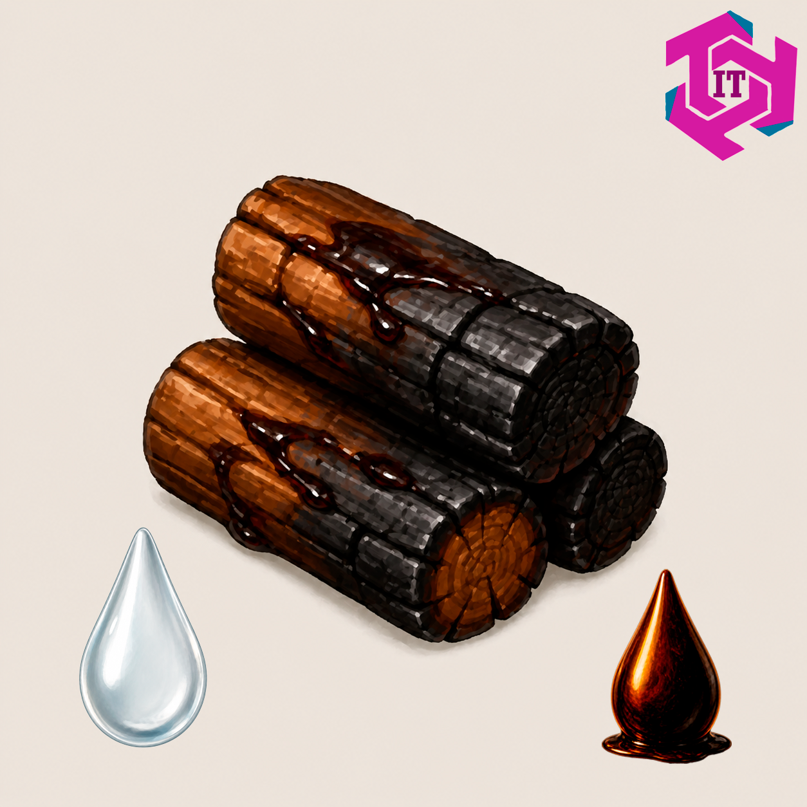

# Wood Pyrolysis

<p align="center">
  
</p>

A [Factorio 2.0](https://www.factorio.com/) mod that adds a historically-grounded wood pyrolysis processing chain as an early-game alternative to petroleum.

## Overview

Before oil refineries, industry ran on wood. This mod lets you do the same — thermally decompose wood into useful chemical feedstocks and work your way up to plastics and synthetic fuels without touching crude oil.

## Processing Chain

```
Wood
 └─► [Chemical Plant] Wood Pyrolysis
       ├─► Biochar          (solid fuel, 4 MJ — coal substitute)
       ├─► Pyrolysis Oil
       └─► Wood Gas
             │
             ├─► [Oil Refinery] Fischer-Tropsch Synthesis
             │     ├─► Light Oil
             │     ├─► Petroleum Gas
             │     └─► Water
             │
             └─► [Oil Refinery] Bio-Oil Distillation  (from Pyrolysis Oil)
                   ├─► Heavy Oil
                   ├─► Methanol
                   └─► Water
                         │
                         ├─► [Chemical Plant] Bakelite Synthesis
                         │     └─► Plastic Bars  (+ Coal)
                         │
                         └─► [Chemical Plant] Methanol-to-Fuel
                               └─► Solid Fuel
```

## New Content

| Type | Name | Notes |
|------|------|-------|
| Item | Biochar | 4 MJ solid fuel, coal substitute |
| Fluid | Pyrolysis Oil | Dark bio-oil from wood decomposition |
| Fluid | Wood Gas | CO + H₂ syngas mixture |
| Fluid | Methanol | Wood alcohol, precursor to plastics and fuel |
| Recipe | Wood Pyrolysis | Chemical Plant |
| Recipe | Fischer-Tropsch Synthesis | Oil Refinery |
| Recipe | Bio-Oil Distillation | Oil Refinery |
| Recipe | Bakelite Synthesis | Chemical Plant |
| Recipe | Methanol-to-Fuel | Chemical Plant |

## Machines

All recipes use **vanilla machines** — no new buildings required.

- **Chemical Plant** — Wood Pyrolysis, Bakelite Synthesis, Methanol-to-Fuel
- **Oil Refinery** — Fischer-Tropsch Synthesis, Bio-Oil Distillation
- **Cryogenic Plant** *(Space Age)* — Wood Pyrolysis, Fischer-Tropsch Synthesis

## Historical Notes

The recipes are inspired by real industrial chemistry:

- **Wood Pyrolysis** — practised since antiquity; the primary source of charcoal, tar, and wood spirit before the petroleum era.
- **Fischer-Tropsch Synthesis** — developed in the 1920s by Franz Fischer and Hans Tropsch to produce liquid fuels from syngas.
- **Bio-Oil Distillation** — 19th-century wood-distillation industry separated pyroligneous acid into methanol, acetic acid, and tar fractions.
- **Bakelite Synthesis** — Leo Baekeland's 1907 phenol-formaldehyde resin, the first fully synthetic plastic, made via methanol-derived formaldehyde.
- **Methanol-to-Fuel** — Mobil's 1970s MTG process converts methanol into hydrocarbons over a zeolite catalyst.

## License

[CC0 1.0 Universal](LICENSE) — public domain.
